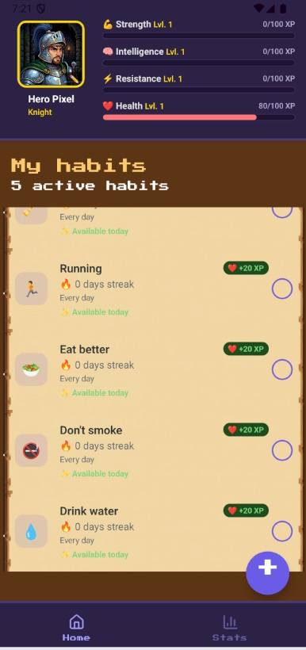
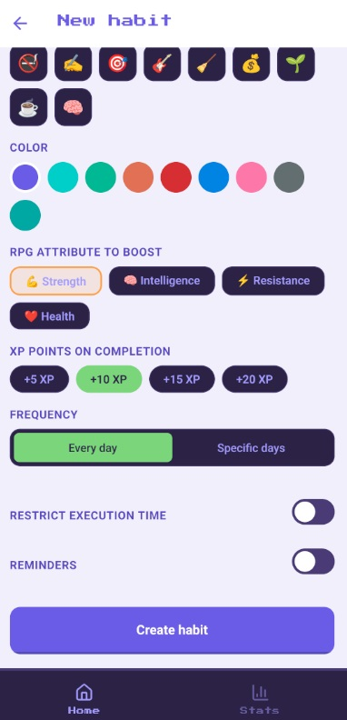
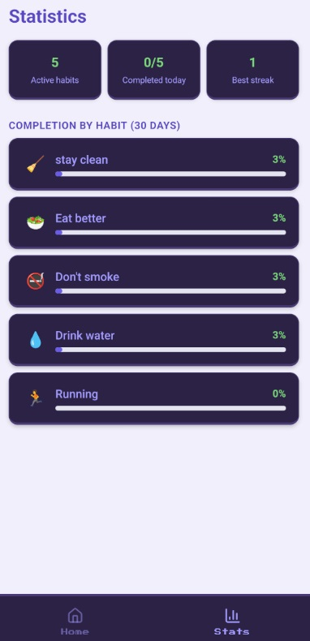

# 🎮 Habit Chronicles — Open Source Habit Tracker

[](LICENSE)

**Habit Chronicles** es una app de React Native para trackear hábitos con gamificación RPG. Crea y monitorea tus hábitos diarios con un sistema de rachas, calendario visual, recordatorios y estadísticas progresivas.

## ✨ Características

- 📅 **Calendario visual** de hábitos completados
- 🔥 **Sistema de rachas** para motivación continua
- 🎮 **Gamificación RPG** — sube de nivel y gana logros
- 🔔 **Recordatorios** locales configurables
- 📊 **Estadísticas** y progreso visual
- 🎨 **Totalmente personalizable** — colores, fuentes, emojis

## � Capturas de Pantalla

<div align="center">
  <table>
    <tr>
      <td align="center">
        <strong>Pantalla Principal</strong><br>
        
      </td>
      <td align="center">
        <strong>Crear Hábito</strong><br>
        
      </td>
      <td align="center">
        <strong>Estadísticas</strong><br>
        
      </td>
    </tr>
  </table>
</div>

## �🚀 Inicio Rápido

### Requisitos
- Node.js 18+
- npm o yarn
- Expo CLI (`npm install -g expo-cli`)

### Instalación

1. Clonar el repo:
   ```bash
   git clone https://github.com/tu-usuario/habit-chronicles.git
   cd habit-chronicles
   ```

2. Instalar dependencias:
   ```bash
   npm install
   ```

3. Iniciar en desarrollo:
   ```bash
   npm start
   ```

4. Escanear el código QR con **Expo Go** (Android/iOS) o presionar `a` / `i` para emulador.

### Tests

```bash
npm test
```

## 🎨 Personalización

Toda la personalización está centralizada en [`constants/theme.js`](constants/theme.js):

- **`COLORS`** — paleta de colores general + colores para cada hábito
- **`FONT_SIZES` / `FONT_WEIGHTS`** — escala tipográfica
- **`SPACING`** — espaciados consistentes (xs, sm, md, lg, xl, xxl)
- **`RADIUS`** — bordes redondeados
- **`HABIT_ICONS`** — emojis disponibles al crear un hábito
- **`WEEK_DAYS`** — etiquetas de días

Simplemente modifica esos valores y la app se actualiza automáticamente en toda la interfaz.

## 📁 Estructura del Proyecto

```
.
├── components/       # Componentes reutilizables (Card, Calendar, ProgressBar)
├── screens/         # Pantallas principales (Home, Habit Detail, Stats)
├── context/         # Context API (Hábitos, RPG state)
├── utils/           # Utilidades (fechas, storage, notificaciones)
├── constants/       # Tema y configuración centralizada
└── __tests__/       # Pruebas unitarias
```

## 📦 Tech Stack

- **React Native** 0.86 + **Expo** 57
- **React Navigation** para enrutamiento
- **AsyncStorage** para persistencia
- **Jest** + Testing Library para tests
- **TypeScript** para type safety

## 📝 Licencia

MIT — Libre para usar, modificar y distribuir. Ver [`LICENSE`](LICENSE) para detalles.

## que incluye esta app

- ✅ Crear hábitos con nombre, icono, color y frecuencia (diaria o días
  específicos de la semana)
- ✅ Marcar el hábito como completado cada día desde la pantalla principal
- ✅ Calendario mensual por hábito (tocando un día se alterna su estado,
  útil para cargar historial pasado)
- ✅ Cálculo de racha actual y mejor racha histórica
- ✅ Recordatorios diarios con notificaciones locales (expo-notifications)
- ✅ Pantalla de estadísticas con resumen general y % de cumplimiento por
  hábito (últimos 30 días)
- ✅ Edición y eliminación de hábitos


